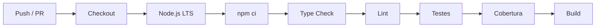

# Integração Contínua

Este documento descreve a pipeline de Integração Contínua (CI) do TaskFlow, implementada com GitHub Actions.

> Documentação relacionada: [testing.md](testing.md) · [development-guide.md](development-guide.md) · [architecture.md](architecture.md)

## Objetivo

Garantir que toda alteração enviada ao repositório passe por validações automáticas de qualidade antes de ser integrada à branch `main`. A pipeline detecta erros de tipagem, problemas de lint, falhas em testes e quebras de build o mais cedo possível.

## Quando a pipeline é executada

A pipeline **TaskFlow CI Pipeline** é disparada automaticamente nos seguintes eventos:

| Evento | Branch |
|--------|--------|
| `push` | `main` |
| `pull_request` | `main` |

## Fluxo da pipeline



Cada etapa depende da anterior. Se qualquer etapa falhar, o workflow é interrompido imediatamente (**fail fast**), evitando desperdício de tempo e recursos.

## Etapas

| # | Etapa | Comando | Descrição |
|---|-------|---------|-----------|
| 1 | Checkout | — | Clona o repositório no runner |
| 2 | Node.js | — | Instala Node.js 24 nos runners do GitHub Actions |
| 3 | Dependências | `npm install --no-audit --no-fund` | Instala dependências a partir do `package-lock.json` |
| 4 | Type Check | `npm run type-check` | Valida tipos TypeScript sem emitir arquivos |
| 5 | Lint | `npm run lint` | Analisa o código com Oxlint |
| 6 | Testes | `npm test` | Executa a suíte de testes com Vitest |
| 7 | Cobertura | `npm run coverage` | Gera relatório de cobertura de testes |
| 8 | Build | `npm run build` | Compila a aplicação para produção |

## Ambiente

- **Sistema operacional:** Ubuntu Latest
- **Node.js:** 24 LTS (compatível com os runners do GitHub Actions)
- **Gerenciador de pacotes:** npm com cache habilitado

## O que é o GitHub Actions?

O [GitHub Actions](https://docs.github.com/pt/actions) é a plataforma de automação integrada ao GitHub. Permite definir workflows em arquivos YAML (`.github/workflows/`) que executam tarefas em runners hospedados na nuvem sempre que eventos do repositório ocorrem — como pushes e pull requests.

No TaskFlow, o GitHub Actions atua como guardião da qualidade: cada contribuição é verificada automaticamente, sem depender de validação manual.

## Boas práticas adotadas

1. **Instalação reproduzível** — `package-lock.json` versionado; `npm install` na CI respeita o lockfile.
2. **Fail fast** — etapas sequenciais interrompem o pipeline na primeira falha.
3. **Node 24** — compatível com os runners atuais do GitHub Actions.
4. **Validação completa** — tipagem, lint, testes, cobertura e build em um único workflow.
5. **Escopo limitado à `main`** — evita execuções desnecessárias em branches de experimentação.

## Executar localmente

Antes de enviar alterações, execute os mesmos comandos da pipeline:

```bash
npm ci
npm run type-check
npm run lint
npm test
npm run coverage
npm run build
```

## O que não está incluído

Esta pipeline cobre apenas **Integração Contínua (CI)**. Os seguintes itens não fazem parte do escopo atual:

- Deploy
- Docker
- Banco de dados
- CD (Continuous Delivery)
